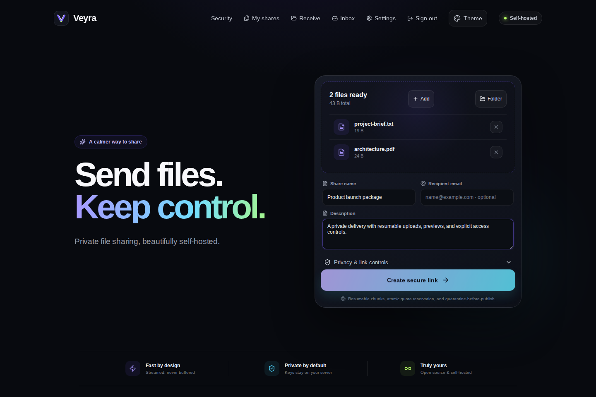

<p align="center">
  
</p>

<p align="center">
  Private file sharing, beautifully self-hosted.
</p>

<p align="center">
  <a href="https://github.com/Liionboy/veyra/actions/workflows/ci.yml"></a>
  <a href="https://github.com/Liionboy/veyra/releases"></a>
  <a href="https://hub.docker.com/r/adrianbrisca/veyra"></a>
  <a href="LICENSE"></a>
  
</p>

<p align="center">
  
</p>

Veyra is a modern, security-focused file-sharing platform for a single
self-hosted server. It combines resumable uploads, private recipient links,
reverse upload requests, multi-user administration, optional malware
quarantine, S3-compatible storage, OIDC, email delivery, and controlled
branding in one container.

Veyra is an original implementation inspired by the product experience of
[Pingvin Share](https://github.com/stonith404/pingvin-share) and
[Pingvin Share X](https://github.com/smp46/pingvin-share-x). No source code is
copied from either project.

## Highlights

### Send and receive

- Files and complete folders with safe relative-path handling
- Resumable, offset-checked chunk uploads
- Crash reconciliation between staged bytes and durable upload offsets
- Live percentage, transfer speed, and estimated time remaining
- Share title, description, recipient email, password, expiry, and download
  limit
- Cryptographically secure password generator with one-click copy and an
  explicit, less-secure option to include the password in the first recipient
  email
- Direct file links, QR codes, safe previews, and streamed **Download all**
  ZIP archives
- Reverse shares: expiring links through which external people can deliver
  files into a private inbox
- Email verification, share delivery, invitations, password recovery, and
  reverse-submission notifications

### Identity and administration

- Local accounts with salted `scrypt` passwords
- TOTP two-factor authentication and one-time recovery codes
- Expiring, revocable invitation onboarding and optional controlled registration
- OIDC Authorization Code flow with PKCE, state, and nonce validation
- Per-user, per-share, and instance storage quotas
- Minimum-free-space protection and persistent quota reservations
- Global aggregate administration without implicit access to filenames,
  tokens, previews, or file contents
- Member suspension, session revocation, and explicit public-link revocation

### Storage and security

- Local filesystem or S3-compatible object storage
- Opaque UUID object keys; user paths never become storage keys
- Durable deletion outbox with bounded retries for local, quarantine, and S3
- SHA-256 recorded for every uploaded object
- Optional fail-closed ClamAV scanning through `clamd` INSTREAM
- Infected or unscannable uploads move to quarantine before publication
- High-entropy public capabilities indexed by one-way hashes
- Recoverable owner and invitation links encrypted with AES-256-GCM
- Strict CSP, `nosniff`, HSTS support, rate limits, and scoped `HttpOnly`
  cookies
- Six accessible themes and controlled name, accent, tagline, and raster logo
  branding

## Quick start

Requirements:

- Docker Engine with Compose v2
- OpenSSL
- Approximately 512 MB available RAM for Veyra itself
- A persistent volume sized for the files you intend to retain

### Docker Hub image (recommended)

```bash
mkdir veyra
cd veyra

curl -fsSLO https://raw.githubusercontent.com/Liionboy/veyra/main/docker-compose.hub.yml
curl -fsSL https://raw.githubusercontent.com/Liionboy/veyra/main/.env.example -o .env

mkdir -p .secrets
chmod 700 .secrets
openssl rand -base64 -out .secrets/veyra_secret 48
openssl rand -base64 -out .secrets/veyra_ip_salt 32
chmod 644 .secrets/veyra_secret .secrets/veyra_ip_salt

docker compose -f docker-compose.hub.yml pull
docker compose -f docker-compose.hub.yml up -d
```

The private `0700` directory protects the secret files on the host. Their
`0644` mode lets the image's non-root user read Docker Compose file-backed
secrets regardless of the host user's numeric ID.

Open <http://localhost:8080> and create the first administrator account.
Application data is retained in the `veyra-data` Docker volume.

Keep both secret files unchanged for the lifetime of the instance. Back up the
`.secrets` directory together with the data volume.

Useful commands:

```bash
docker compose -f docker-compose.hub.yml ps
docker compose -f docker-compose.hub.yml logs -f veyra
docker compose -f docker-compose.hub.yml pull
docker compose -f docker-compose.hub.yml up -d
```

### Build from source

Clone the repository, generate the same two secret files shown above, then
build locally:

```bash
git clone https://github.com/Liionboy/veyra.git
cd veyra
cp .env.example .env
mkdir -p .secrets
chmod 700 .secrets
openssl rand -base64 -out .secrets/veyra_secret 48
openssl rand -base64 -out .secrets/veyra_ip_salt 32
chmod 644 .secrets/veyra_secret .secrets/veyra_ip_salt
docker compose up --build -d
docker compose ps
docker compose logs -f veyra
```

## Reverse proxy and HTTPS

For an internet-facing instance, terminate TLS at a trusted reverse proxy and
set:

```env
VEYRA_BASE_URL=https://share.example.com
VEYRA_SECURE_COOKIES=true
VEYRA_TRUST_PROXY=true
```

Forward traffic to Veyra over HTTP on port `8080`. For large and resumable
uploads, an Nginx-compatible proxy should include:

```nginx
client_max_body_size 0;
proxy_request_buffering off;
proxy_buffering off;
proxy_read_timeout 3600s;
proxy_send_timeout 3600s;
send_timeout 3600s;
```

Do not expose port `8080` directly to the Internet, and do not enable secure
cookies until the public HTTPS endpoint works.

## Capacity policy

Initial limits can be supplied through environment variables and later changed
from **Settings → Capacity**:

| Variable | Default | Meaning |
| --- | ---: | --- |
| `VEYRA_MAX_FILE_SIZE` | 10 GiB | Maximum size of one file |
| `VEYRA_MAX_SHARE_SIZE` | 50 GiB | Maximum total size of one share |
| `VEYRA_DEFAULT_USER_QUOTA` | 100 GiB | Default retained storage per user; `0` disables |
| `VEYRA_INSTANCE_QUOTA` | `0` | Instance retained storage cap; `0` disables |
| `VEYRA_MIN_FREE_BYTES` | 5 GiB | Space that local staging must preserve |
| `VEYRA_MAX_FILES_PER_SHARE` | 500 | Maximum manifest entries |
| `VEYRA_UPLOAD_CHUNK_SIZE` | 8 MiB | Resumable chunk size |
| `VEYRA_UPLOAD_SESSION_HOURS` | 24 | Incomplete-session lifetime |

Veyra reserves quota atomically when an upload session is created. Reservations
are released on completion, cancellation, or expiry, preventing concurrent
uploads from oversubscribing the same quota.

## Optional integrations

### SMTP

Configure SMTP under **Settings → Outgoing email**. Veyra supports implicit TLS
(usually port 465) or required STARTTLS (usually port 587). The SMTP password is
encrypted at rest using the instance secret.

Share passwords remain hash-only in Veyra. If a sender explicitly chooses to
include one in the recipient email, the browser supplies it only while the
upload is finalized; Veyra verifies it against the stored hash, sends it in that
first email, and does not retain a recoverable copy. Manual email retries always
send only the share link. Sending the link and password through separate
channels remains the recommended option.

### ClamAV

Veyra connects to an external `clamd` endpoint and streams each staged file
with the INSTREAM protocol. Enable it under **Settings → Antivirus** only after
the connectivity test succeeds.

> ClamAV signature reloads commonly need 2.4–4 GB of RAM. On smaller hosts,
> run `clamd` on another machine or allocate a strict, separately monitored
> container. Veyra intentionally does not start a ClamAV container by default.

When scanning is enabled, Veyra fails closed: no public link, recipient email,
or reverse-submission notification becomes available until every file is
clean. An infected file or scanner failure quarantines the complete upload.

### S3-compatible storage

Configure the endpoint, region, bucket, prefix, path-style option, and
credentials under **Settings → Storage**, then run the built-in probe before
switching the active backend. AWS S3, MinIO, and compatible services are
supported.

Files are staged locally for resume and scanning, then committed to S3 using
bounded multipart concurrency. Existing objects retain their recorded backend.
Keep credentials available while any S3-backed objects remain. Veyra preserves
the configured S3 location when new uploads switch back to local storage and
blocks bucket, endpoint, region, or prefix changes while S3 objects still
depend on that location; credentials may still be rotated.

### OpenID Connect

Create an OIDC client with this callback URL:

```text
https://share.example.com/api/v1/auth/oidc/callback
```

Configure issuer, client ID, client secret, label, and registration policy in
**Settings → Single sign-on**. Veyra:

- uses Authorization Code with PKCE;
- validates issuer, state, nonce, and subject;
- stores one-use login transactions;
- never auto-links an existing account by email;
- requires an authenticated account-link flow for existing users.

## Privacy model

A public share URL is a bearer capability. Anyone who has an unprotected URL
can access it until it expires, is revoked, or reaches its download limit.
Passwords add a short-lived scoped access grant but do not replace careful link
distribution.

Reverse submissions are separate private inbox objects, not hidden public
shares. Their anonymous upload token authorizes only the matching incomplete
upload session.

Administrators can see global owner, status, count, and byte aggregates and can
revoke access. The global administration API intentionally excludes filenames,
descriptions, public tokens, previews, and file bodies.

See [SECURITY.md](SECURITY.md) for the full security model and responsible
disclosure guidance.

## Development

Veyra requires Node.js 22.13 or newer.

```bash
npm ci
npm run dev
```

The Vite frontend runs on <http://localhost:5173> and proxies API requests to
the Fastify server on port `8080`.

Run the complete verification suite:

```bash
npm run check
```

The suite covers authentication primitives, migrations, quota reservations,
resumable offsets, folder paths, Range previews, ZIP delivery, reverse
submissions, quarantine behavior, themes, and end-to-end API flows.

## Architecture

```text
Browser
  │ HTTPS
  ▼
Reverse proxy
  │ HTTP
  ▼
Veyra (Fastify + React)
  ├── SQLite metadata, identities, reservations, and audit events
  ├── local staging and quarantine
  ├── local objects or S3-compatible object storage
  ├── optional clamd scanner
  ├── optional SMTP server
  └── optional OIDC provider
```

Veyra targets a dependable single-node deployment. SQLite, local staging, and
one application replica are deliberate operational boundaries in v1.0.

## Project documents

- [Security policy](SECURITY.md)
- [Changelog](CHANGELOG.md)
- [Roadmap](ROADMAP.md)
- [Contributing guide](CONTRIBUTING.md)
- [Code of Conduct](CODE_OF_CONDUCT.md)
- [Docker Hub description](DOCKERHUB.md)

## Docker image

Stable images are published at
[adrianbrisca/veyra](https://hub.docker.com/r/adrianbrisca/veyra).

- `1.1.0` — release tag
- `latest` — newest stable release
- Seven-character commit SHA — immutable source reference

The initial release supports `linux/amd64`. Veyra is a single-node
application; do not scale multiple containers against the same `/data` volume.

## License

Veyra is released under the [MIT License](LICENSE).
